# smart-water-quality-monitoring-system

IoT-based Smart Water Quality Monitoring System using Raspberry Pi Pico W for real-time analysis of water quality parameters including pH, TDS, air temperature, and water temperature.

## Project Overview

This project aims to develop a low-cost and scalable water quality monitoring solution capable of continuously monitoring important water parameters in real time.

The system uses multiple sensors connected to a Raspberry Pi Pico W to collect environmental and water-quality data. The collected data can be analyzed locally and extended to cloud platforms for intelligent monitoring and predictive analytics.

## Features

* Real-time water quality monitoring
* pH measurement
* TDS (Total Dissolved Solids) monitoring
* Water temperature monitoring
* Ambient temperature monitoring
* LCD display for live readings
* Raspberry Pi Pico W based processing
* Scalable IoT architecture
* Future-ready AI integration

## Hardware Components

| Component                 | Purpose                         |
| ------------------------- | ------------------------------- |
| Raspberry Pi Pico W       | Main controller                 |
| pH Sensor (HW-828)        | Measures acidity and alkalinity |
| TDS Sensor V1.0           | Measures dissolved solids       |
| DS18B20                   | Water temperature sensing       |
| DHT11                     | Ambient temperature sensing     |
| I2C LCD Display           | Real-time display               |
| Breadboard & Jumper Wires | Circuit implementation          |

## System Architecture

1. Sensor Data Acquisition
2. Signal Processing
3. Data Analysis
4. LCD Visualization
5. Cloud/AI Integration (Future Scope)

## Project Workflow

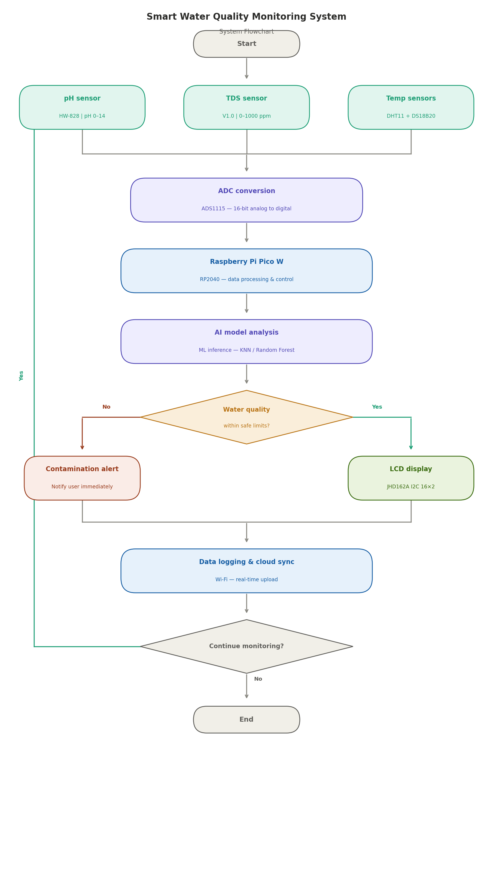

*Figure 1: Working flow of the Smart Water Quality Monitoring System.*

## Circuit Diagram

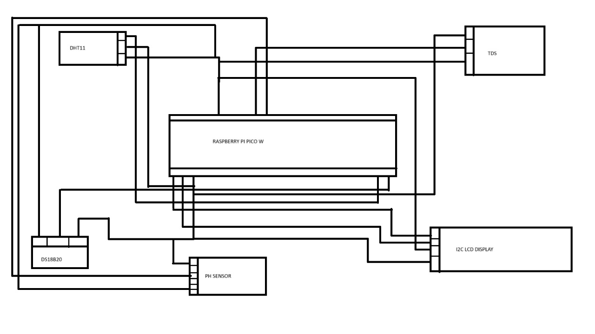

*Figure 2: Circuit diagram of the Smart Water Quality Monitoring System.*

## Hardware Components

### Raspberry Pi Pico W

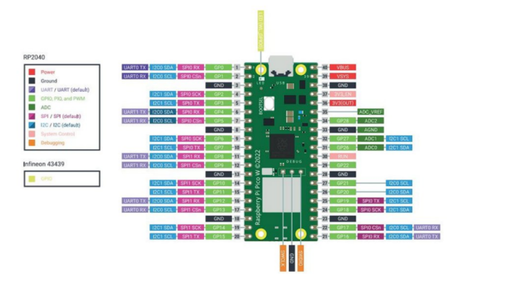

*Figure 3: Raspberry Pi Pico W used as the central processing and control unit.*

### pH Sensor

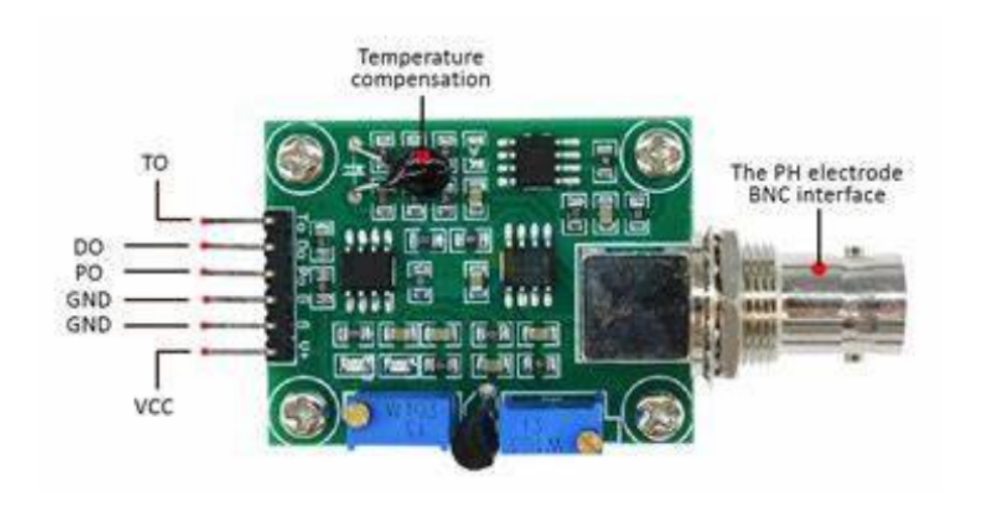

*Figure 4: pH sensor used for measuring water acidity and alkalinity.*

### TDS Sensor

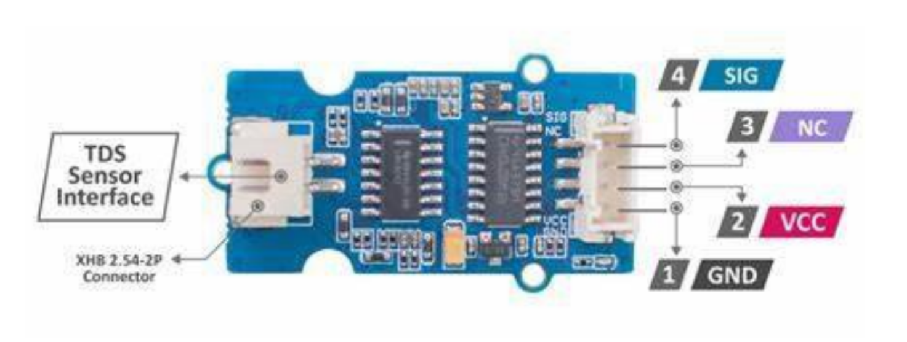

*Figure 5: TDS sensor used for measuring dissolved solids in water.*

### DS18B20 Water Temperature Sensor

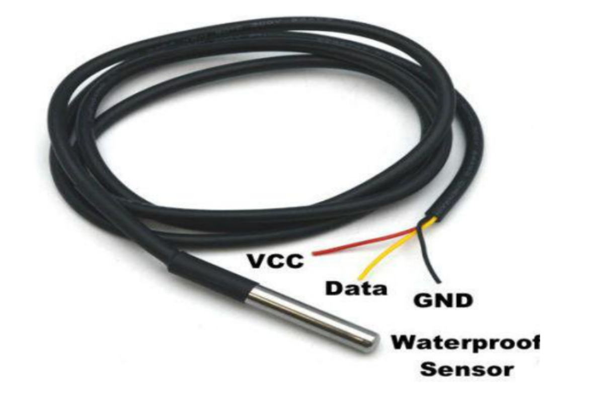

*Figure 6: DS18B20 sensor used for water temperature monitoring.*

### DHT11 Temperature Sensor

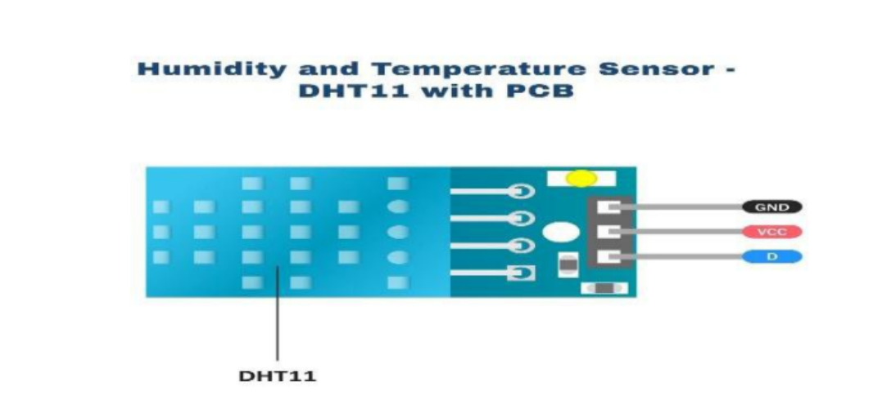

*Figure 7: DHT11 sensor used for ambient temperature monitoring.*

### I2C LCD Display

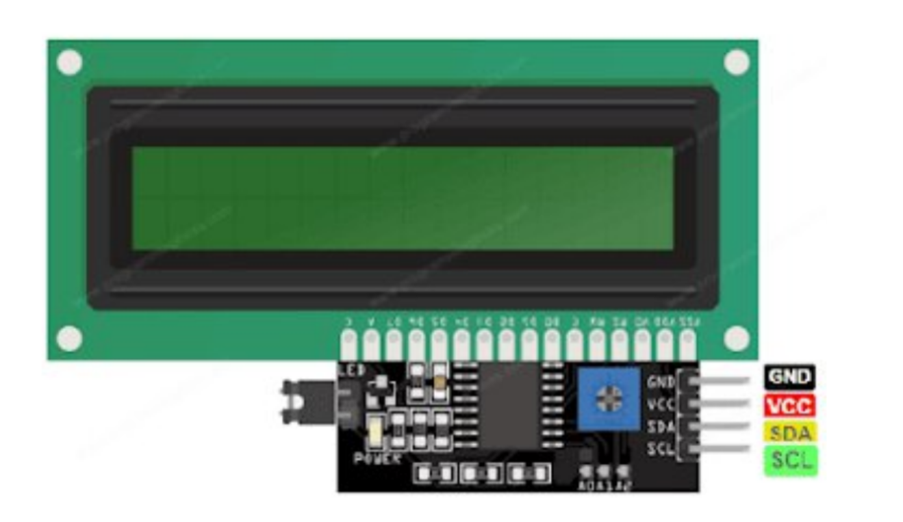

*Figure 8: LCD display used for real-time visualization of sensor readings.*

## Results

### Water Quality Monitoring

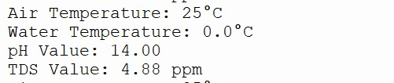

*Figure 9: Sample dataset generated during system testing.*

### Water Quality Dataset

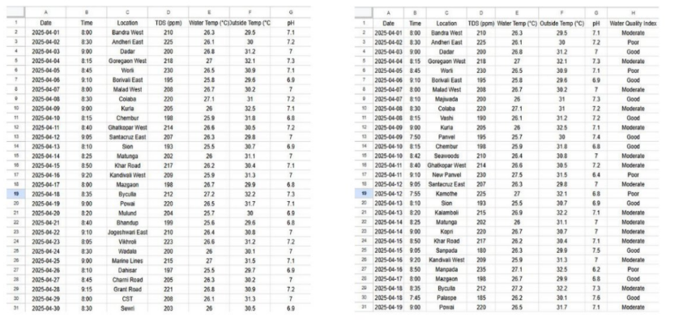

*Figure 10: Experimental results obtained from water quality analysis.*

### Water Quality Mapping

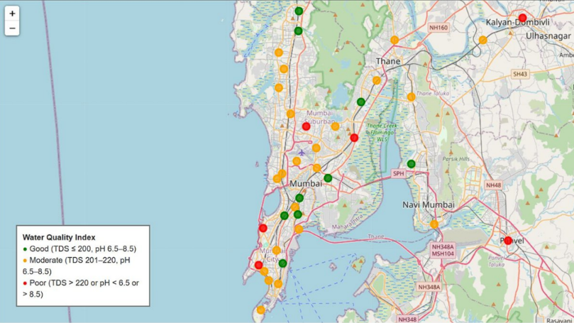

*Figure 11: Water quality mapping based on collected sensor data.*

## Technologies Used

* Raspberry Pi Pico W
* MicroPython
* Python
* IoT
* Embedded Systems
* Sensor Interfacing
* Data Analytics

## Applications

* Drinking Water Monitoring
* Rural Water Supply Systems
* Smart Cities
* Aquaculture
* Agriculture
* Environmental Monitoring

## Future Scope

* Cloud Dashboard Integration
* Mobile Application
* AI-based Water Quality Prediction
* Remote Monitoring
* Heavy Metal Detection
* National-scale Water Monitoring Infrastructure

## Documentation

[View Full Project Report](docs/mini-project-report.pdf)

## Author

* Ansh Taralekar

